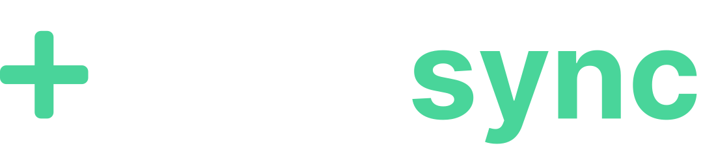

<a name="readme-top"></a>

[![LinkedIn][linkedin-shield]][linkedin-url]


<!-- PROJECT LOGO -->
<br />
<div align="center">
  <a href="https://github.com/othneildrew/Best-README-Template">
    
  </a>

  <h3 align="center">Medisyn API</h3>

  <p align="center">
    An awesome API for the Medisync application!
    <!-- <br />
    <a href="https://github.com/othneildrew/Best-README-Template"><strong>Explore the docs »</strong></a>
    <br /> -->
  </p>
</div>


<!-- TABLE OF CONTENTS -->
<details>
  <summary>Table of Contents</summary>
  <ol>
    <li>
      <a href="#about-the-project">About The Project</a>
    </li>
    <li>
      <a href="#getting-started">Requirements</a>
      <ul>
        <li><a href="#prerequisites">Prerequisites</a></li>
        <li><a href="#installation">Installation</a></li>
      </ul>
    </li>
    <li><a href="#usage">Usage</a></li>
    <li><a href="#roadmap">Roadmap</a></li>
    <li><a href="#contact">Contact</a></li>
  </ol>
</details>


<!-- ABOUT THE PROJECT -->
## About The Project


Medisync is a Spring Boot API designed for managing registrations of doctors, patients, and appointments. It uses the MySQL database and offers basic CRUD (Create, Read, Update, Delete) functionalities for each entity.

<p align="right">(<a href="#readme-top">back to top</a>)</p>

<!-- Requirements-->
## Requirements

This is an example of how you may give instructions on setting up your project locally.
To get a local copy up and running follow these simple example steps.

### Dependencies

* Spring Boot
* Spring Data JPA
* Flyway (for databse migration)
* Lombok
* Maven


### Installation

_Below is an example of how you can instruct your audience on installing and setting up your app. This template doesn't rely on any external dependencies or services._

1. Clone the Repository
   ```sh
   git clone https://github.com/your_username/medisync.git
   ```
2. Configure the Database
   * Create a MySQL database named medisync.
   * Configure the database access credentials in the src/main/resources/application.properties file.
3. Run the Application
   ```sh
    mvn spring-boot:run
   ```

<p align="right">(<a href="#readme-top">back to top</a>)</p>


<!-- USAGE EXAMPLES -->
## Endpoints

The API provides the following endpoints:

* /doctors: CRUD for doctors.
* /patients: CRUD for patients.
* /appointments: CRUD for appointments.
* /user: Login to use the application

### Authentication

To perform any operation other than login, it is necessary to include an authentication token in the request header.

## Examples

#Retrieving Doctors
```sh
  Authorization: YOUR_TOKEN_HERE
  GET http://localhost:8080/doctors
```

Example Response
```js
  {
    "id": 9,
    "name": "Doctor ex",
    "email": "doctor@sync.med",
    "npi": "123453",
    "specialty": "CARDIOPEDIA"
  }
```
### Retrieving Doctor Details

To retrieve details for a specific doctor, include the doctor's ID in the endpoint URL and provide the authentication token in the request header.

#### Example Request

```sh
Authorization: YOUR_TOKEN_HERE
GET http://localhost:8080/doctors/9
```

Example Response
```js
  {
    {
    "id": 1,
    "name": "Gabriel",
    "email": "gabriel.ianess@sync.med",
    "phone": "12345678",
    "npi": "123454",
    "specialty": "CARDIOPEDIA",
    "address": {
        "street": "rua 1",
        "district": "bairro",
        "zip": "12345678",
        "city": "Brasilia",
        "state": "DF",
        "complement": "complemento",
        "number": "1"
    }
}
  }
```

### Registering a New Doctor

To register a new doctor, use the following endpoint with the appropriate authentication token and provide the necessary details in the request body.

#### Example Request

```sh
Authorization: YOUR_TOKEN_HERE
POST http://localhost:8080/doctors
```

Payload body
```js
  {
    {
    "id": 1,
    "name": "Gabriel",
    "email": "gabriel.ianess@sync.med",
    "phone": "12345678",
    "npi": "123454",
    "specialty": "CARDIOPEDIA",
    "address": {
        "street": "rua 1",
        "district": "bairro",
        "zip": "12345678",
        "city": "Brasilia",
        "state": "DF",
        "complement": "complemento",
        "number": "1"
    }
}
  }
```
Example Response
```js
  {
    {
    "id": 1,
    "name": "Gabriel",
    "email": "gabriel.ianess@sync.med",
    "phone": "12345678",
    "npi": "123454",
    "specialty": "CARDIOPEDIA",
    "address": {
        "street": "rua 1",
        "district": "bairro",
        "zip": "12345678",
        "city": "Brasilia",
        "state": "DF",
        "complement": "complemento",
        "number": "1"
    }
}
  }
```


<p align="right">(<a href="#readme-top">back to top</a>)</p>

<!-- CONTACT -->
## Contact

Davi Brantes  - davi.brantes@gmail.com

[linkedin-shield]: https://img.shields.io/badge/-LinkedIn-black.svg?style=for-the-badge&logo=linkedin&colorB=555


<p align="right">(<a href="#readme-top">back to top</a>)</p>


[linkedin-url]: https://www.linkedin.com/in/davi-brantes/
